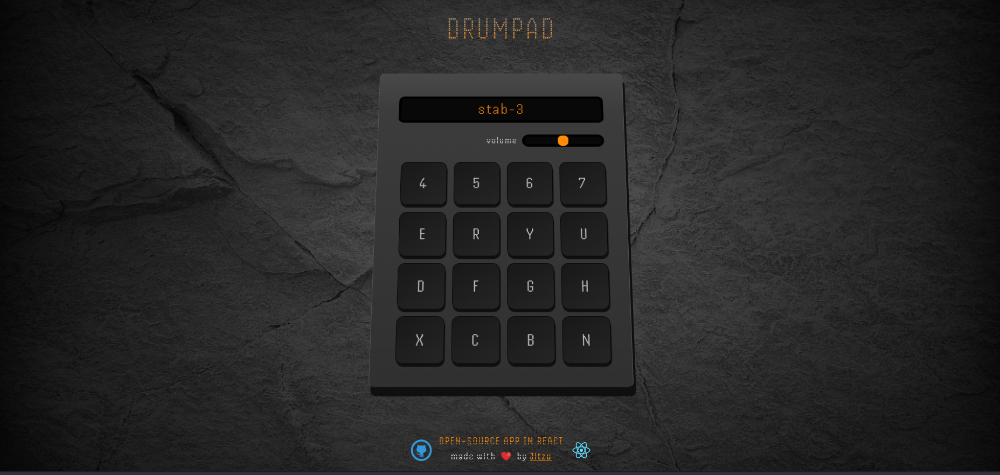

# Jitzu Drum Pad App

Jitzu Drum Pad App is a web application that allows you to play samples using your computer keyboard or by tapping on the screen.

[TRY IT NOW](https://jitzu-drum-pad.vercel.app)



## Key Features

- **Keyboard Trigger**: Play drum pads using corresponding keyboard keys.
- **Volume Control**: Adjust the volume with a simple slider.
- **Intuitive Interface**: Easy-to-use interface suitable for both desktop and mobile devices.

## How to Use

1. **Site**: Go to this link: https://jitzu-drum-pad.vercel.app
1. **Main Interface**: The main screen displays all available drum pads.
1. **Keyboard Keys**: Use the corresponding keyboard keys to trigger drum sounds.
1. **Volume Slider**: Slide the volume control to adjust the sound intensity.
1. **Mobile Interaction**: Tap the drum pads on the screen to play sounds.

##° Installation

Optionally you can download the repo and install the app.
Make sure you have the following installed on your machine:

- `Node.js`: Download and install `Node.js` from nodejs.org.

#### Clone Repository

Clone the repository using Git:

```bash
git clone https://github.com/your-username/your-repository.git
Replace your-username and your-repository with your GitHub username and the name of your repository.
```

#### Navigate to Project Directory

Navigate into the cloned repository:

```bash
cd your-repository
```

#### Install Dependencies

Install the necessary dependencies using npm:

```bash
npm install
```

#### Run the Application

Start the application locally:

```bash
npm start
```

The application will be running at _http://localhost:3000_. Open this URL in your web browser to view the application.

## Contributing

We welcome contributions! If you'd like to improve the application or add new features, feel free to fork the repository and submit a pull request.
